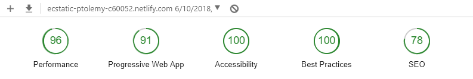

# Mobile Web Specialist Certification Course

---

This repo aims to satisfy the criteria for the stage one project of the Udacity Mobile Web Specialist course.

A fresh preview of the app is available at: [https://ecstatic-ptolemy-c60052.netlify.com/](https://ecstatic-ptolemy-c60052.netlify.com/)

If you want to run it locally clone the repo and install the dependencies:

`$ git clone https://github.com/jumpalottahigh/mws-restaurant-stage-1`

`$ cd mws-restaurant-stage-1`

`$ npm install`

To build and run the project:

`$ npm start`

Production assets are located in the `build/` directory.

Current PWA state:

